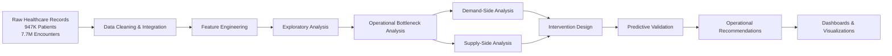

# Analytics Pipeline

## Overview

This project followed a systems-oriented healthcare analytics workflow rather than a traditional prediction-only pipeline.

The analysis began with large-scale raw healthcare encounter data and evolved through iterative exploratory analysis, operational bottleneck identification, intervention design, and predictive validation.

The final workflow combined:

- healthcare analytics
- operational systems thinking
- intervention modeling
- patient flow analysis
- provider capacity analysis
- executive-facing visualization

The project was intentionally structured as an operational intelligence and healthcare systems redesign case study.
