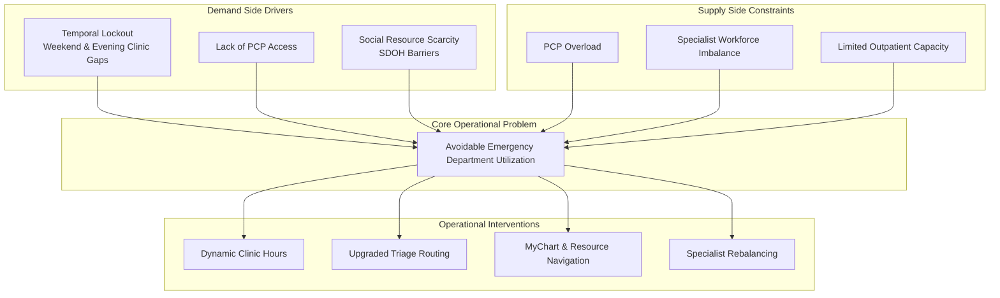

# Demand–Supply Framework

## Framework Summary

This project framed avoidable emergency department utilization as a systems coordination problem rather than a patient behavior problem.

The analysis identified both demand-side and supply-side structural failures contributing to emergency department overcrowding.

### Demand-Side Drivers

- Temporal healthcare access gaps
- Lack of PCP relationships
- Social resource scarcity and SDOH barriers

### Supply-Side Constraints

- PCP overload
- Specialist workload imbalance
- Limited outpatient absorption capacity

### Operational Goal

The project focused on identifying scalable operational interventions capable of reducing avoidable ED burden using existing healthcare system resources rather than major policy or staffing expansion.
